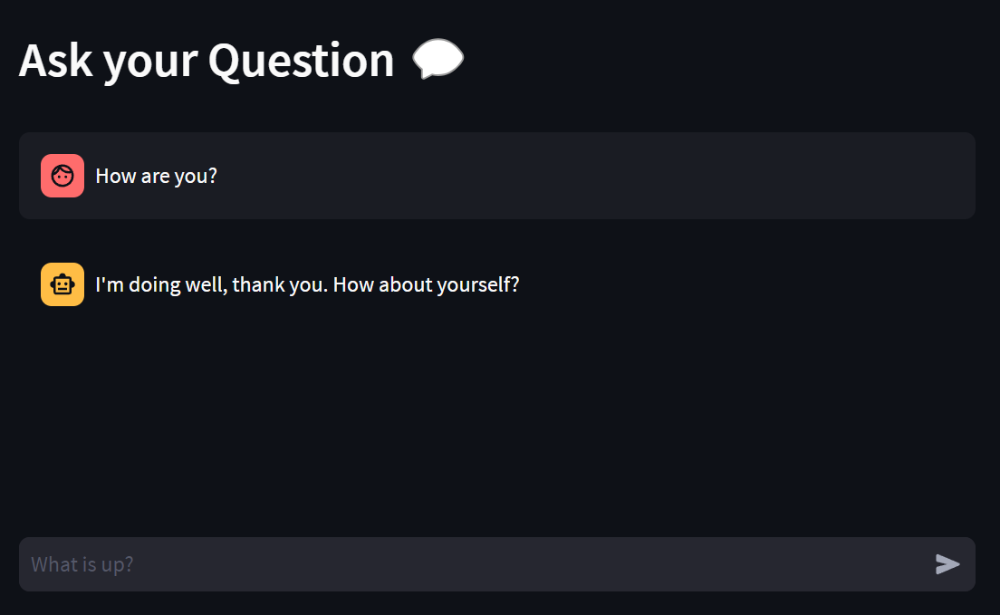

## Streamlit bot



This is an example to deploy a Streamlit bot with LocalAI instead of OpenAI. Instructions are for Windows.

```
# Clone LocalAI
git clone https://github.com/go-skynet/LocalAI

cd LocalAI

# (optional) Checkout a specific LocalAI tag
# git checkout -b build <TAG>

# Use a template from the examples
cp -rf prompt-templates/ggml-gpt4all-j.tmpl models/

# (optional) Edit the .env file to set things like context size and threads
# vim .env

cd ..

# Clone example
git clone https://github.com/majoshi1/localai_streamlit_bot

cd localai_streamlit_bot

install_requirements.bat

# Download model
python download-model.py TheBloke/mpt-30B-chat-GGML --specific-file mpt-30b-chat.ggmlv0.q4_1.bin --output ..\LocalAI\models --clean --max-retries 10

cd ..\LocalAI

# Install Docker Desktop

# start with docker-compose
docker-compose up -d --pull always
# or you can build the images with:
# docker-compose up -d --build
# Now API is accessible at localhost:8080
curl http://localhost:8080/v1/models
# {"object":"list","data":[{"id":"ggml-gpt4all-j","object":"model"}]}

curl http://localhost:8080/v1/chat/completions -H "Content-Type: application/json" -d '{
     "model": "ggml-gpt4all-j",
     "messages": [{"role": "user", "content": "How are you?"}],
     "temperature": 0.9
   }'

# {"model":"ggml-gpt4all-j","choices":[{"message":{"role":"assistant","content":"I'm doing well, thanks. How about you?"}}]}

cd ..\localai_streamlit_bot

# run the bot
start_windows.bat

# UI will be launched automatically (http://localhost:8501/) in browser.

```

